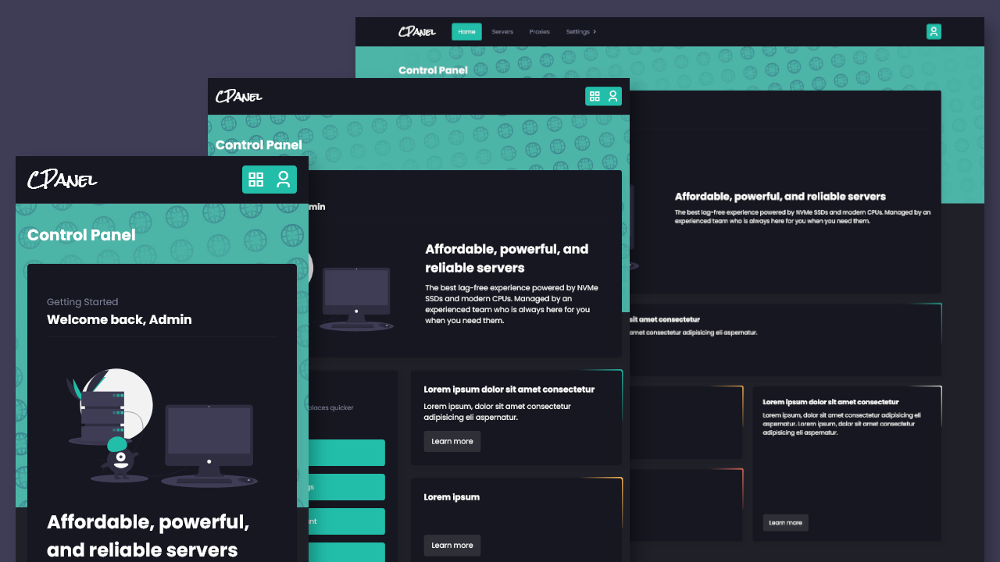

## Build A Responsive Dashboard Website With HTML, CSS, and JavaScript

> Improve your HTML and CSS skills by building a responsive dashboard website. After completing this lesson, you will be able to create responsive layouts using Flexbox and Grid. You will also learn to add dropdown menu as well as implement a dark & light mode theme using local storage and JavaScript. 

#### Watch the video [here](https://youtu.be/rkkxpGEYDFo)

